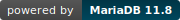

# Seamless-RAG

**Vector Search & Structured-Data RAG Toolkit for MariaDB**

> Turn any MariaDB table into a searchable vector store. Query results come back in TOON v3 tabular format — a compact wire format that saves 10-55% of tokens (vs compact JSON) when feeding structured data to LLMs or agents.


[](https://python.org)
[]()
[](LICENSE)
[]()

---

## Quick Start for Judges

> Evaluating this submission? Start with **[JUDGES_TESTING_GUIDE.md](JUDGES_TESTING_GUIDE.md)** — four progressive paths from inspect-only (5 min, no install) to full test suite (15 min).

90-second verification:

```bash
git clone https://github.com/SunflowersLwtech/seamless-rag.git
cd seamless-rag
docker compose up -d --wait
docker compose exec app seamless-rag demo
```

A 90-second screencast of the same flow lives at [`docs/assets/demo.gif`](docs/assets/demo.gif) (also [demo.mp4](docs/assets/demo.mp4)):


---

## MariaDB Features We Use

This project is MariaDB-native end-to-end. The pipeline only works because of features that landed in MariaDB 11.7.2+ and is explicitly tuned for them — no external vector store, no shadow index, no application-side ANN.

| Feature | What we use it for | Where in the code |
|---|---|---|
| **`VECTOR(N)` column type** | First-class storage for 384-dim float32 embeddings, no `BLOB` workaround | [`storage/mariadb.py:112`](src/seamless_rag/storage/mariadb.py#L112) (schema), [`storage/mariadb.py:227`](src/seamless_rag/storage/mariadb.py#L227) (auto-add column for arbitrary tables) |
| **`VECTOR INDEX … DISTANCE=cosine`** (HNSW) | Sub-linear similarity search; we tune `mhnsw_ef_search = 100` per session for recall/latency trade-off | [`storage/mariadb.py:114`](src/seamless_rag/storage/mariadb.py#L114), [`storage/mariadb.py:337`](src/seamless_rag/storage/mariadb.py#L337) |
| **`VEC_DISTANCE_COSINE`** | Distance function in `ORDER BY` so the planner picks the HNSW index | [`storage/mariadb.py:343`](src/seamless_rag/storage/mariadb.py#L343), [`storage/mariadb.py:362`](src/seamless_rag/storage/mariadb.py#L362) |
| **Native binary protocol** via `mariadb-connector-python` | `array.array('f', embedding)` is sent verbatim — no `VEC_FromText` round-trip, no string parsing | [`storage/mariadb.py:254`](src/seamless_rag/storage/mariadb.py#L254), [`storage/mariadb.py:288`](src/seamless_rag/storage/mariadb.py#L288) (batch insert) |
| **CTE for context windowing** | Single round-trip retrieval: closest chunks plus their neighbours by `chunk_order` | [`storage/mariadb.py:341`](src/seamless_rag/storage/mariadb.py#L341) (`WITH closest AS …`) |
| **Hybrid SQL filter + vector ORDER BY** | `seamless-rag ask "waterproof watches" --where "price < 50"` — SQL pre-filter narrows the candidate set, vector ranks within | [`storage/mariadb.py:315`](src/seamless_rag/storage/mariadb.py#L315) (validated WHERE), [`storage/mariadb.py:362`](src/seamless_rag/storage/mariadb.py#L362) (combined query) |
| **Connection pool + autocommit** | `mariadb.ConnectionPool` with per-call lease, isolation-aware so the watcher never sees stale snapshots | [`storage/mariadb.py:158`](src/seamless_rag/storage/mariadb.py#L158), [`storage/mariadb.py:178`](src/seamless_rag/storage/mariadb.py#L178) |
| **Foreign keys + composite index** | `chunks.document_id REFERENCES documents(id)` plus `INDEX idx_doc_order(document_id, chunk_order)` so the CTE neighbour-join stays index-only | [`storage/mariadb.py:117-118`](src/seamless_rag/storage/mariadb.py#L117) |
| **Auto-schema for arbitrary tables** | `seamless-rag embed --table products --columns name,category` adds a `VECTOR(N)` column and HNSW index to your existing table without touching its other columns | [`storage/mariadb.py:227-232`](src/seamless_rag/storage/mariadb.py#L227) |
| **Bare `VEC_DISTANCE()` auto-pick** (MariaDB-only) | When the index has `DISTANCE=cosine`, plain `VEC_DISTANCE(...)` reads it from the index and applies cosine — no other RDBMS does this. Demonstrated live by `seamless-rag schema` | [`storage/mariadb.py:431`](src/seamless_rag/storage/mariadb.py#L431) (`compare_vec_distance`), [`tests/integration/test_vector_operations.py`](tests/integration/test_vector_operations.py) (1e-6 equivalence assertion) |

**See it for yourself in 5 seconds:** `seamless-rag schema` pretty-prints `SHOW CREATE TABLE chunks` (highlighting `vector(384)` and `VECTOR KEY ... DISTANCE=cosine`), `SHOW INDEX FROM chunks` (with the `VECTOR` row called out), and runs a side-by-side `VEC_DISTANCE()` vs `VEC_DISTANCE_COSINE()` query so you can verify auto-pick parity yourself.

**Tested against MariaDB 11.8** (the version shipped in the official `mariadb:11.8` Docker image). 11/11 integration tests pass against the real server, exercising every feature above — see [`tests/integration/test_vector_operations.py`](tests/integration/test_vector_operations.py).

Without MariaDB's VECTOR + HNSW, this project would either need a sidecar vector DB (Chroma/Qdrant/pgvector) or a from-scratch ANN implementation. Neither would be MariaDB-native, neither would benefit from the same indexes that already serve OLTP traffic.

---

## Why

LLMs and agents consume structured data as context. The standard approach — dumping JSON — wastes tokens on repeated field names and structural characters:

```json
[{"id":1,"name":"Widget","category":"Tools","price":29.99,"stock":150,"supplier":"Acme","rating":4.5},
 {"id":2,"name":"Gadget","category":"Tools","price":19.99,"stock":300,"supplier":"Acme","rating":4.2}]
```

TOON tabular writes field names once, values as compact rows:

```
[2,]{id,name,category,price,stock,supplier,rating}:
  1,Widget,Tools,29.99,150,Acme,4.5
  2,Gadget,Tools,19.99,300,Acme,4.2
```

**Measured on real public datasets** ([full benchmark](docs/BENCHMARK_REAL_DATA.md)):

| Dataset (query type) | Rows | JSON Tokens | TOON Tokens | Savings |
|---------------------|------|-------------|-------------|---------|
| MovieLens — top rated movies (7 cols) | 100 | 6,540 | 5,019 | **23.3%** |
| MovieLens — metadata only (4 cols) | 100 | 2,258 | 1,364 | **39.6%** |
| SF Restaurant — violations (9 cols) | 100 | 7,071 | 4,326 | **38.8%** |
| SF Restaurant — high risk (9 cols) | 50 | 3,437 | 2,076 | **39.6%** |

Savings scale with row count and stabilize at the dataset's natural ceiling:

| Rows | MovieLens (7 cols) | Restaurant (9 cols) |
|------|--------------------|---------------------|
| 10 | 21.7% | 34.6% |
| 50 | 22.0% | 38.2% |
| 100 | 24.1% | 38.8% |
| 500 | **29.0%** | **38.9%** |

TOON is not magic — it shines on **structured tabular data with many columns and short values**, which is exactly what comes out of database queries. All measurements use compact JSON (`separators=(",",":")`) as baseline.

## Where It Fits

For structured database data, the industry uses two retrieval approaches. Seamless-RAG bridges both to LLMs:

```
"Q3 revenue by region?"           "Find products similar to X"
        │                                    │
   Text-to-SQL                        Vector Search
   (LLM generates SQL)              (cosine similarity)
        │                                    │
        └──────────┬─────────────────────────┘
                   ▼
           MariaDB executes
                   ▼
           list[dict] results
                   ▼
        Seamless-RAG → TOON format     ← saves 20-40% tokens
                   ▼
           LLM / Agent consumes
```

- **Precise queries** ("revenue > 1M"): write SQL directly, use `seamless-rag export` to TOON-format the results
- **Semantic queries** ("similar products"): use `seamless-rag ask` for vector search on text columns
- **Hybrid** ("waterproof watches under $50"): `seamless-rag ask --where "price < 50"` combines both

Seamless-RAG is a **format + embedding bridge**, not a replacement for SQL.

## Quick Start

Your data is already in MariaDB. Seamless-RAG adds vectors and TOON.

```bash
pip install -e ".[mariadb,embeddings]"         # install
docker compose up -d                            # MariaDB 11.8

seamless-rag init                               # create VECTOR columns + HNSW index
seamless-rag embed --table products --column description  # embed existing rows
seamless-rag ask "Which products are most relevant?"      # vector search → TOON → LLM
seamless-rag export "SELECT id, name, price FROM products LIMIT 20"  # SQL → TOON
```

No file loading, no document chunking — data lives in MariaDB, Seamless-RAG bridges it to vectors and LLMs.

## CLI Commands

```
seamless-rag init              Create VECTOR columns + HNSW index
seamless-rag embed             Bulk-embed existing table rows (core workflow)
seamless-rag watch             Auto-embed new inserts in real time (Rich live)
seamless-rag ask <question>    Vector search → TOON context → LLM answer
seamless-rag export <sql>      Any SELECT → TOON format
seamless-rag benchmark         JSON vs TOON token/cost comparison
seamless-rag web               Gradio web UI (localhost-only by default)
seamless-rag demo              End-to-end demo with sample data
seamless-rag ingest <path>     Convenience: load text files for quick testing
```

**Multi-column embedding** — embed multiple columns for richer semantics:

```bash
# Single column (default)
seamless-rag embed --table products --column description

# Multi-column — values concatenated for richer vector search
seamless-rag embed --table products --columns "name,category,price,rating"
# Internally: "Widget — Tools — 29.99 — 4.5"

# Now "cheap high-rated tools" matches on price AND rating, not just description
seamless-rag ask "cheap high-rated tools" --where "price < 50"
```

Global options: `--host`, `--port`, `--database`, `--provider`, `--model`, `--log-level`

## As Agent Tools

Seamless-RAG commands work as agent tools. An LLM agent can call these to interact with MariaDB:

```python
# Agent tool: search MariaDB and get compact context
result = rag.ask("quarterly revenue by region", top_k=10)
# result.context_toon → compact tabular format for next LLM call
# result.savings_pct → token savings vs compact JSON

# Agent tool: export any SQL query as TOON
toon = rag.export("SELECT region, revenue, quarter FROM sales")
# Feed to next agent step with minimal token overhead

# Agent tool: multi-column embed for richer search
rag.embed_table("products", text_column=["name", "category", "price"])
# "Widget — Tools — 29.99" → vector search matches name AND price
```

In a 20-step agent workflow querying a database at each step (measured on real data):

| Dataset | JSON (20 steps) | TOON (20 steps) | Tokens Saved | Cost Saved |
|---------|-----------------|-----------------|--------------|------------|
| MovieLens (7 cols, 50 rows/step) | 73,680 | 58,760 | **14,920** | $0.037 |
| Restaurant (9 cols, 50 rows/step) | 69,640 | 42,640 | **27,000** | $0.068 |

## Python API

```python
from seamless_rag import SeamlessRAG

with SeamlessRAG(host="localhost", database="mydb") as rag:
    rag.init()
    rag.ingest("research.txt", ["chunk1...", "chunk2..."])

    # Single-column embed (default)
    rag.embed_table("articles", text_column="content")

    # Multi-column embed — richer semantics
    rag.embed_table("products", text_column=["name", "category", "price"])

    # Semantic search with hybrid filter
    result = rag.ask("affordable tools", where="price < 50", mmr=True)
    print(result.answer)           # LLM-generated answer
    print(result.context_toon)     # compact context
    print(f"Saved {result.savings_pct:.0f}% tokens")
```

## Pluggable Providers

Both embedding and LLM layers use `typing.Protocol` — no base class needed:

| Layer | Providers | Default |
|-------|-----------|---------|
| Embedding | SentenceTransformers, Gemini, OpenAI, Ollama | SentenceTransformers (local, free) |
| LLM | Ollama, Gemini, OpenAI | Ollama (local, free) |

Switch via env vars: `EMBEDDING_PROVIDER=gemini LLM_PROVIDER=openai seamless-rag ask "..."`

See [Providers guide](docs/providers.md) for adding custom providers.

## Architecture

```
seamless-rag CLI / Python API / Agent Tools
    │
    ├── EmbeddingProvider (Protocol)     ← 4 built-in, add your own
    ├── LLMProvider (Protocol)           ← 3 built-in, add your own
    ├── VectorStore (Protocol)           ← MariaDB with connection pool
    │     └── VECTOR(N) + HNSW index + VEC_DISTANCE_COSINE
    ├── AutoEmbedder                     ← batch + watch, multi-column concat
    ├── RAGEngine                        ← search → TOON → LLM (retry) → benchmark
    ├── TOONEncoder                      ← full v3 spec (166/166)
    └── TokenBenchmark                   ← tiktoken + GPT-4o cost calc
```

## Test Results

```
538 tests passing (100%)
  lint:        100%
  unit:        100% (338/338)
  spec:        100% (166/166 TOON v3 conformance)
  integration: 100% (17/17)
  eval:        100%
```

## Security

- **SQL injection prevention**: WHERE filters and SELECT queries validated via [sqlglot](https://github.com/tobymao/sqlglot) AST parsing — blocks writes, DDL, subqueries, and dangerous functions (SLEEP, BENCHMARK, LOAD_FILE)
- **Web UI**: binds `127.0.0.1` by default; `--share` requires auth via `SEAMLESS_WEB_USER` / `SEAMLESS_WEB_PASSWORD`; error messages never leak server internals
- **LLM calls**: context truncated to 20K chars; retry with jitter for transient errors; rate-limit detection
- **Identifiers**: all table/column names validated against `^[A-Za-z_][A-Za-z0-9_]*$`

## Built for the MariaDB Ecosystem

<p align="center">
  
</p>

- **MariaDB 11.7+** VECTOR columns, HNSW indexes, VEC_DISTANCE_COSINE
- **Native binary protocol** via `mariadb-connector-python` (array.array float32)
- **Connection pooling** with unique pool names for concurrent instances
- **Version validation** (>= 11.7.2) on init

## License

```
Copyright 2026 LiuWei (SunflowersLwtech)
Licensed under the Apache License, Version 2.0
```

See [LICENSE](LICENSE) | [CONTRIBUTING](CONTRIBUTING.md) | [Documentation](https://sunflowerslwtech.github.io/seamless-rag/)
