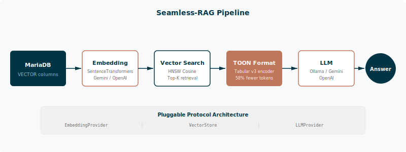
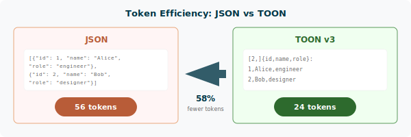

# Seamless-RAG

**TOON-Native Auto-Embedding & RAG Toolkit for MariaDB**

> Automatically embed your MariaDB tables and query them with RAG -- results formatted in TOON v3 for 30-58% token savings over JSON.


[](https://python.org)
[]()
[](LICENSE)
[]()

---

## Overview

Seamless-RAG connects MariaDB's native VECTOR columns with a pluggable embedding and LLM layer. Query results are serialized using the TOON v3 tabular format, which eliminates repeated field names and cuts token usage by up to 58% compared to JSON.



### Key Features

- **Auto-Embed** -- Point at any MariaDB table, embed text columns with local or cloud models
- **Watch Mode** -- Polls for new inserts and auto-embeds them in real time
- **RAG Query** -- Vector search, TOON-formatted context, LLM answer in one call
- **Token Savings** -- Every query reports JSON vs TOON token comparison
- **Model-Agnostic** -- Swap embedding/LLM providers via config or environment variables

## Quick Start

### Prerequisites

- Python 3.12+
- MariaDB 11.7+ (with VECTOR support)
- Docker (recommended for MariaDB)

### Install

```bash
git clone https://github.com/SunflowersLwtech/seamless-rag.git
cd seamless-rag
conda create -n seamless-rag python=3.12 -y
conda activate seamless-rag
pip install -e ".[dev,mariadb,embeddings]"

# Start MariaDB
docker compose up -d
```

### Usage

```bash
# Initialize database schema
seamless-rag init

# Ingest text files (auto-chunks and embeds)
seamless-rag ingest ./data/articles/

# Watch for new rows and auto-embed
seamless-rag watch --table articles --column content --interval 2

# Ask a question (with token benchmark + LLM answer)
seamless-rag ask "What are the key findings on climate change?"

# Export SQL results as TOON
seamless-rag export "SELECT id, title, content FROM articles LIMIT 10"
```

### Python API

```python
from seamless_rag import SeamlessRAG

rag = SeamlessRAG(host="localhost", database="mydb", password="secret")

# Embed all rows
rag.embed_table("articles", text_column="content")

# RAG query with automatic token benchmarking
result = rag.ask("What are the main topics?")
print(result.context_toon)      # TOON-formatted context
print(f"Tokens saved: {result.savings_pct:.1f}%")
print(f"JSON: {result.json_tokens} -> TOON: {result.toon_tokens}")
```

## TOON Format

TOON v3 tabular format eliminates key repetition in structured data, reducing token counts sent to LLMs.



| Queries/day | JSON tokens | TOON tokens | Monthly cost @ $2.50/1M | Savings |
|-------------|-------------|-------------|-------------------------|---------|
| 1,000       | 56,000      | 36,960      | $4.20 -> $2.77          | 34%     |
| 10,000      | 560,000     | 324,800     | $42.00 -> $24.36        | 42%     |
| 100,000     | 5,600,000   | 2,688,000   | $420 -> $202            | 52%     |

## Pluggable Providers

Both embedding and LLM layers use `typing.Protocol` -- implement the interface and it works:

```python
from seamless_rag.providers.protocol import EmbeddingProvider

class MyProvider:
    @property
    def dimensions(self) -> int:
        return 1024

    def embed(self, text: str) -> list[float]:
        return my_api.embed(text)

    def embed_batch(self, texts: list[str], batch_size: int = 32) -> list[list[float]]:
        return my_api.embed_batch(texts)
```

Built-in providers: **SentenceTransformers** (local, default), **Gemini**, **OpenAI**, **Ollama**.

See the [Providers guide](docs/providers.md) for configuration details.

## Architecture

```
SeamlessRAG (facade)
+-- EmbeddingProvider (Protocol)     <- pluggable
|   +-- SentenceTransformersProvider <- local, free (384d)
|   +-- GeminiEmbeddingProvider      <- google-genai SDK (768d)
|   +-- OpenAIEmbeddingProvider      <- openai SDK (3072d)
+-- LLMProvider (Protocol)           <- pluggable
|   +-- OllamaLLMProvider            <- local REST (default)
|   +-- GeminiLLMProvider            <- gemini-2.5-flash
|   +-- OpenAILLMProvider            <- gpt-4o
+-- MariaDBVectorStore               <- VECTOR + HNSW cosine search
+-- AutoEmbedder                     <- watch + batch with retry
+-- RAGEngine                        <- search -> TOON -> LLM -> benchmark
+-- TOONEncoder                      <- full v3 spec (166/166)
+-- TokenBenchmark                   <- tiktoken cl100k_base
```

## Test Results

```
Overall: 99.6% (489/491 passed)
  lint:        100%
  unit:        99.7% (298/299)
  spec:        100%  (166/166) -- full TOON v3 conformance
  props:       91.7% (11/12)
  integration: 100%  (17/17)
  eval:        100%
```

```bash
make test-all         # lint + unit + spec (no Docker)
make test-full        # all suites including integration
make score            # quality score dashboard
```

## Project Structure

```
src/seamless_rag/
+-- toon/encoder.py          # TOON v3 encoder (166/166 spec)
+-- benchmark/compare.py     # Token comparison (tiktoken)
+-- providers/               # EmbeddingProvider: ST, Gemini, OpenAI + factory
+-- llm/                     # LLMProvider: Ollama, Gemini, OpenAI + factory
+-- storage/mariadb.py       # VectorStore with HNSW cosine search
+-- pipeline/embedder.py     # Auto-embed (batch + watch)
+-- pipeline/rag.py          # RAG engine + benchmark + LLM
+-- core.py                  # SeamlessRAG facade
+-- cli.py                   # Typer CLI
+-- config.py                # Pydantic Settings
```

## Contributing

Contributions are welcome. Please:

1. Fork the repository and create a feature branch
2. Run `make test-all` before submitting a PR
3. Follow the existing code style (enforced by `ruff`)
4. Add tests for new functionality

See the [Contributing guide](docs/contributing.md) for development setup details.

## License

[Apache-2.0](LICENSE)
